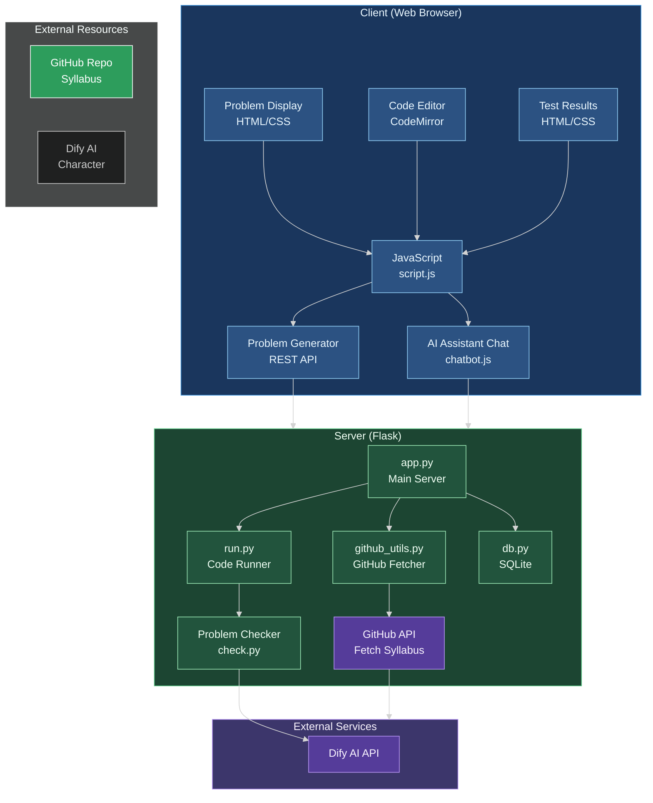
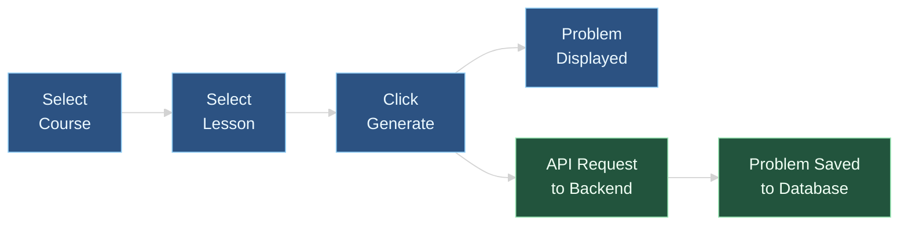
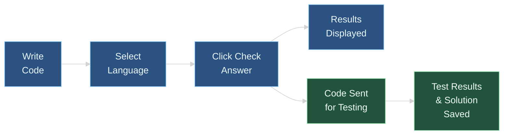
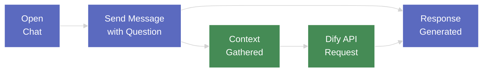
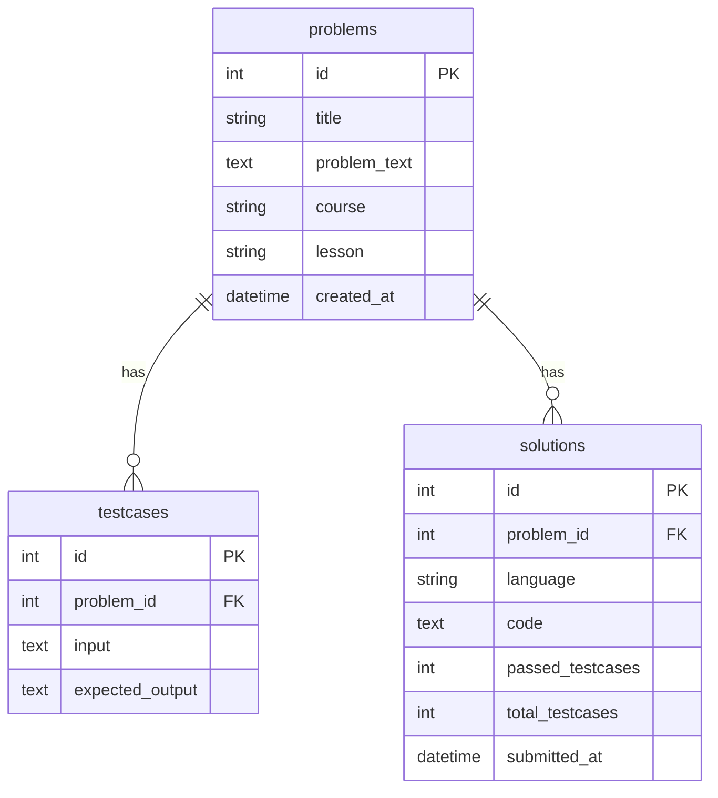

# Problem Generator - Architecture & Tech Stack

## System Architecture

## Tech Stack Overview

### Frontend
- **HTML/CSS/JavaScript**: Core web technologies for UI and functionality
- **CodeMirror**: Advanced code editor with syntax highlighting for multiple languages
- **Marked.js**: For rendering markdown content in problems and help documentation
- **KaTeX**: For rendering LaTeX mathematical formulas in problem descriptions and AI responses
- **Fetch API**: For making AJAX requests to the backend

### Backend
- **Flask**: Python web framework for serving the application
- **SQLite**: Lightweight database for storing problems and solutions
- **GitHub API**: For fetching syllabus content and lessons

### Code Execution
- **Python Interpreter**: For running Python code submissions
- **Java Compiler & JVM**: For compiling and running Java code
- **G++ Compiler**: For compiling and running C++ code

### AI Assistant
- **Dify API**: AI platform for the embedded chatbot assistant

## Key User Flows

### 1. Problem Generation Flow

### 2. Code Checking Flow

### 3. Chat Assistant Flow

## Database Schema

## Programming Languages Support

The application supports multiple programming languages:

1. **Python**
   - File type: `.py`
   - Execution: Direct interpreter execution
   - Libraries: Standard Python libraries

2. **Java**
   - File type: `.java`
   - Execution: Compilation with `javac` and execution with `java`
   - Entry point: Main class with main method

3. **C++**
   - File type: `.cpp`
   - Execution: Compilation with `g++` and execution of binary
   - Standard: C++17

## Environment Configuration

The application uses:
- Environment variables for API keys and configuration
- Local SQLite database for persistent storage
- Browser localStorage for user preferences (theme, etc.)

## Dark/Light Theme Support

The application implements theme switching with:
- CSS variables for theming
- CodeMirror themes that match the overall UI
- Local storage to remember user theme preferences

## GitHub Integration

The application fetches learning materials from GitHub, specifically:
- Lesson indices for navigation
- Syllabus content in Markdown format
- Organized by programming language and difficulty level

---

*Created: April 4, 2025*
