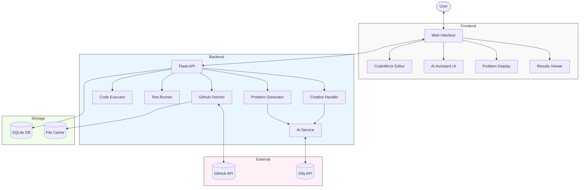
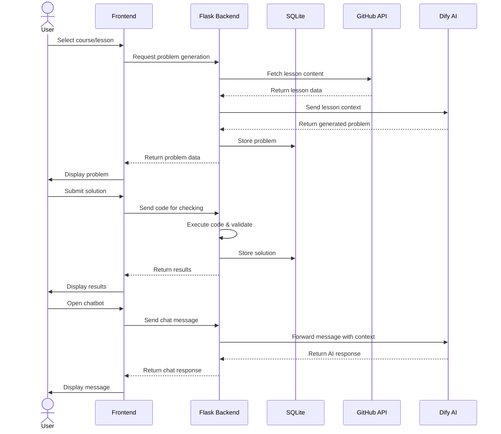
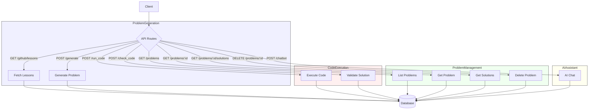

# Developer Reference

This document serves as a comprehensive technical reference for the Problem Generator application.

## Table of Contents
- [Architecture Overview](#architecture-overview)
- [Backend Components](#backend-components)
- [Frontend Components](#frontend-components)
- [Database Schema](#database-schema)
- [API Endpoints](#api-endpoints)
- [External Integrations](#external-integrations)
- [Development Workflow](#development-workflow)
- [Deployment Guide](#deployment-guide)

## Architecture Overview

### High-Level Architecture



The Problem Generator is a web application built with a Flask backend and vanilla JavaScript frontend. It uses SQLite for data persistence and integrates with external services for AI-powered problem generation and assistant features.

### Component Interactions



### Key Components
- **Flask Backend**: Handles API requests, code execution, and problem generation
- **JavaScript Frontend**: Manages the UI, code editor, and user interactions
- **SQLite Database**: Stores problems, solutions, and user history
- **GitHub Integration**: Fetches lesson content from tutorial repositories
- **Dify API**: Provides AI assistant functionality

## Backend Components

### Core Modules

#### `app.py`
The main Flask application that defines routes, initializes the database, and handles requests.

**Key Functions:**
- `serve_index()`: Serves the main application HTML.
- `get_lessons()`: Fetches available lessons from GitHub.
- `generate()`: Generates programming problems using AI.
- `run_code_endpoint()`: Executes user code in various languages.
- `check_code_endpoint()`: Validates user code against test cases.
- `chatbot_endpoint()`: Handles AI assistant interactions.

#### `db.py`
Database interaction layer responsible for data persistence.

**Key Functions:**
- `init_db()`: Initializes the database schema.
- `get_db_connection()`: Creates a connection to the SQLite database.
- `store_problem()`: Saves generated problems.
- `get_problem_by_id()`: Retrieves specific problems.
- `get_problems()`: Lists all stored problems.
- `store_solution()`: Saves user solutions.

#### `github_utils.py`
Utility for fetching content from GitHub repositories.

**Key Functions:**
- `get_file_content()`: Fetches file content with caching.
- `get_lessons()`: Retrieves lesson structure for different languages.
- `build_syllabus()`: Creates a syllabus from multiple lesson files.

#### `chatbot.py`
Integrates with the Dify API for AI assistant functionality.

**Key Functions:**
- `handle_chatbot_request()`: Processes chat messages and returns AI responses.
- `prepare_context()`: Formats problem and code context for the AI.

### Language Support

The application supports multiple programming languages through a unified interface:

```mermaid
flowchart LR
    subgraph LanguageSelection["Language Selection"]  
        Python["Python"]
        Java["Java"]
        CPP["C++"]
    end
    
    subgraph CodeExecutionFlow["Code Execution Flow"]    
        subgraph PythonFlow["Python Execution"]  
            direction TB
            P1["Receive Code"] --> P2["Execute with Python Interpreter"] --> P3["Capture Output"]  
        end
        
        subgraph JavaFlow["Java Execution"]  
            direction TB
            J1["Receive Code"] --> J2["Create Temp Java File"] --> J3["Compile with javac"] 
            J3 --> J4["Execute with java"] --> J5["Capture Output"] --> J6["Clean Up Temp Files"]  
        end
        
        subgraph CppFlow["C++ Execution"]  
            direction TB
            C1["Receive Code"] --> C2["Create Temp C++ File"] --> C3["Compile with g++"] 
            C3 --> C4["Execute Binary"] --> C5["Capture Output"] --> C6["Clean Up Temp Files"]  
        end
    end
    
    Python --> PythonFlow
    Java --> JavaFlow
    CPP --> CppFlow
    
    subgraph TestCaseValidation["Test Case Validation"]  
        direction TB
        T1["Parse JSON Test Cases"] --> T2["Execute Code with Test Inputs"] --> T3["Compare Outputs"] --> T4["Return Results"]  
    end
    
    PythonFlow --> TestCaseValidation
    JavaFlow --> TestCaseValidation
    CppFlow --> TestCaseValidation
    
    style LanguageSelection fill:#f5f5ff,stroke:#333,stroke-width:1px
    style CodeExecutionFlow fill:#fffff0,stroke:#333,stroke-width:1px
    style TestCaseValidation fill:#f0fff0,stroke:#333,stroke-width:1px
```

The application supports multiple programming languages through a unified interface:

- **Python**: Direct execution using the Python interpreter.
- **Java**: Compilation and execution using JDK.
- **C++**: Compilation using g++ and execution of the resulting binary.

Each language implements:
- Code execution with input/output handling
- Syntax highlighting in the editor
- Test case validation with JSON format

## Frontend Components

### Core Files

#### `index.html`
Main HTML structure of the application.

**Key Elements:**
- Course and lesson selection forms
- Code editor container
- Results display area
- Chat UI for the AI assistant
- History modal

#### `script.js`
Core JavaScript functionality for the application.

**Key Functions:**
- `generateProblem()`: Requests problem generation from the backend.
- `runCode()`: Sends code to the backend for execution.
- `checkAnswer()`: Validates user solutions against test cases.
- `loadLessons()`: Populates the lesson dropdown from the GitHub API.
- `setupEventListeners()`: Sets up all UI interaction handlers.
- `toggleTheme()`: Manages theme switching between light and dark modes.

#### `chatbot.js`
JavaScript for the AI assistant functionality.

**Key Functions:**
- `toggleChatWindow()`: Controls chat UI visibility.
- `handleChatSubmit()`: Processes user messages.
- `sendChatRequest()`: Communicates with the backend chatbot endpoint.
- `addBotMessage()`: Renders AI responses with markdown support.

### CSS Styles

- `style.css`: Main styling for the application.
- `dark-mode.css`: Dark theme styling.
- `chatbot.css`: Styling for the chat interface.

### Code Editor

The application uses CodeMirror for the code editor with:
- Syntax highlighting for Python, Java, and C++
- Custom themes (darcula for dark mode, idea for light mode)
- Tab handling and indentation
- Line numbering

## Database Schema

### Entity Relationship Diagram


### Schema Details

#### Problems Table
The `problems` table stores all generated programming challenges with their descriptions, test cases, and metadata.


#### Solutions Table
The `solutions` table tracks user-submitted solutions to problems, including the programming language used.


## API Endpoints


### API Workflow



### Problem Generation
- `GET /github/lessons`: Retrieves available lessons.
- `POST /generate`: Generates a new programming problem.

### Code Execution
- `POST /run_code`: Executes user code and returns output.
- `POST /check_code`: Validates code against test cases.

### Problem Management
- `GET /problems`: Lists all saved problems.
- `GET /problems/<id>`: Retrieves a specific problem.
- `GET /problems/<id>/solutions`: Gets solutions for a problem.
- `DELETE /problems/<id>`: Deletes a problem.

### AI Assistant
- `POST /chatbot`: Sends a message to the AI assistant.

## External Integrations

### GitHub
Used to fetch lesson content and problem templates.

**Integration Points:**
- Retrieves lesson structure from index.json files
- Fetches individual lesson markdown content
- Uses caching to reduce API calls and handle rate limiting

### Dify API
Provides AI functionality for both problem generation and the assistant.

**Integration Points:**
- Problem generation with customized prompts
- AI assistant that understands code context
- Conversation history management

## Development Workflow

### Local Setup
1. Clone the repository
2. Install dependencies from requirements.txt
3. Configure environment variables in .env file
4. Run the development server with `python app.py`

### Environment Variables
- `API_KEY`: Authentication key for the AI service
- `API_URL`: Endpoint for the problem generation API
- `CHATBOT_API_URL`: Endpoint for the assistant API
- `CHATBOT_API_KEY`: Authentication key for the chatbot

## Deployment Guide

### Prerequisites
- Python 3.9+
- SQLite
- Web server (Nginx or similar)
- HTTPS certificate (Let's Encrypt recommended)

### Production Deployment
1. Set up a web server as a reverse proxy
2. Configure WSGI (Gunicorn recommended)
3. Set up HTTPS with Let's Encrypt
4. Configure proper file permissions
5. Set up a systemd service for automatic restart

### Systemd Service Example
```ini
[Unit]
Description=Problem Generator Flask Application
After=network.target

[Service]
User=username
WorkingDirectory=/path/to/problem_generator
ExecStart=/path/to/venv/bin/gunicorn -w 4 -b 127.0.0.1:5000 app:app
Restart=always

[Install]
WantedBy=multi-user.target
```

### Backup Strategy
- Regular SQLite database backups
- Configuration and environment variable backups
- Consider setting up periodic cache clearance for GitHub fetched content
