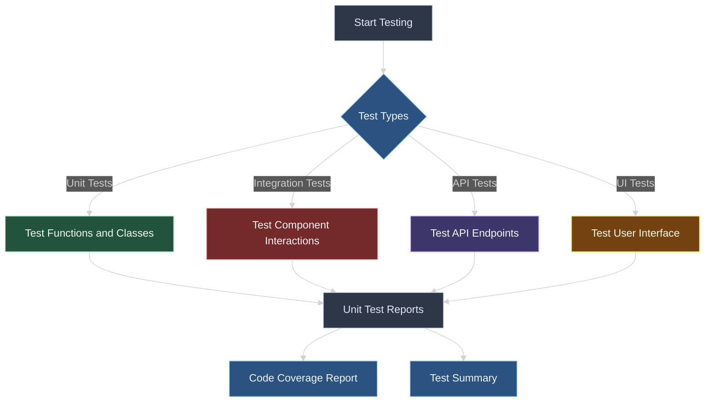

# Testing Guide

This document outlines the testing strategy and procedures for the Problem Generator application.

## Table of Contents
- [Testing Overview](#testing-overview)
- [Test Categories](#test-categories)
- [Running Tests](#running-tests)
- [Test Reports](#test-reports)
- [Continuous Integration](#continuous-integration)
- [Writing New Tests](#writing-new-tests)

## Testing Overview



The Problem Generator application uses a comprehensive testing approach to ensure code quality and functionality. The testing strategy includes:

1. **Unit Tests**: Testing individual functions and classes
2. **Integration Tests**: Testing interactions between components
3. **API Tests**: Testing REST API endpoints
4. **UI Tests**: Testing user interface components and interactions

We use pytest as our primary testing framework for its flexibility and comprehensive feature set.

## Test Categories

### Unit Tests

Unit tests verify the functionality of individual components in isolation:
- Database operations
- GitHub fetcher functionality
- Code execution and validation
- Problem generation logic

### Integration Tests

Integration tests verify that components work together correctly:
- Database and API interactions
- GitHub API integration
- Chatbot and problem generation integration

### API Tests

API tests verify that all API endpoints respond correctly:
- Problem generation endpoints
- Code execution endpoints
- Problem management endpoints
- Chat endpoints

### UI Tests

UI tests verify that the user interface functions correctly:
- Theme switching
- Code editor functionality
- Problem display
- Chat interface

## Running Tests

### Prerequisites

Make sure you have all the testing dependencies installed:

```bash
pip install -r requirements-dev.txt
```

### Running All Tests

To run all tests with coverage report:

```bash
python -m pytest tests/ --cov=. --cov-report=html
```

### Running Specific Test Categories

Unit tests:
```bash
python -m pytest tests/unit/
```

Integration tests:
```bash
python -m pytest tests/integration/
```

API tests:
```bash
python -m pytest tests/api/
```

UI tests:
```bash
python -m pytest tests/ui/
```

> **Note**: By default, UI tests are skipped as they require a running server. See the [UI Testing](#ui-testing) section below for details on how to run UI tests.

### Running Tests with Verbose Output

For more detailed output during test runs:

```bash
python -m pytest -v
```

### Debugging Tests

To debug tests more effectively, you can use the `-s` flag to prevent pytest from capturing output:

```bash
python -m pytest -s tests/path/to/test_file.py
```

You can also run a specific test function:

```bash
python -m pytest tests/path/to/test_file.py::TestClass::test_function -v
```

## Special Testing Considerations

### API Testing

The API tests use Flask's test client to simulate HTTP requests without needing a running server. These tests mock external dependencies like:

- The GitHub API with `patch('github_utils.GitHubFetcher.get_lessons')`
- Code execution with `patch('run.run_code')`
- Database operations with `patch('db.get_problem_by_id')`

API test mocks are configured to return data in the format expected by the frontend:

```python
# Example of mocking check_code response
response_data = {
    "passed": 2,
    "total": 2,
    "results": [
        {"input": "1, 2", "expected_output": "3", "user_output": "3", "status": "✅"},
        {"input": "5, -3", "expected_output": "2", "user_output": "2", "status": "✅"}
    ],
    "success_rate": "2/2"
}
```

### UI Testing

The UI tests use Selenium WebDriver to interact with the browser and test the frontend UI components. By default, UI tests are skipped because they require a running server.

#### Enabling UI Tests

To enable UI tests, you need to:

1. Start the Flask server on port 5000:

```bash
python app.py
```

2. Edit `tests/ui/test_ui_components.py` and set `RUN_LIVE_UI_TESTS = True`

3. Run the UI tests:

```bash
python -m pytest tests/ui/test_ui_components.py -v
```

The UI tests are designed to be resilient using WebDriverWait conditions that ensure elements are properly loaded before interactions. This helps prevent flaky tests due to timing issues.

## Test Reports

After running tests with coverage, reports are generated in the `htmlcov` directory:

```bash
open htmlcov/index.html
```

For generating XML reports (useful for CI integration):

```bash
python -m pytest tests/ --cov=. --cov-report=xml
```

## Continuous Integration

The test suite is configured to run automatically on GitHub Actions:
- On every push to the main branch
- On every pull request

The workflow is defined in `.github/workflows/test.yml`.

## Writing New Tests

### Test File Structure

Tests should follow this naming convention:
- `test_*.py`: Test files
- `*_test.py`: Test files

### Test Structure

For a function `foo` in module `bar.py`, create a test file `tests/unit/test_bar.py`:

```python
import pytest
from app import bar

def test_foo_returns_correct_value():
    # Setup
    expected = "expected value"
    
    # Execute
    result = bar.foo()
    
    # Assert
    assert result == expected
```

### Mocking

Use pytest's monkeypatch or unittest.mock for mocking:

```python
def test_github_fetcher(monkeypatch):
    def mock_get(*args, **kwargs):
        # Return a mock response
        class MockResponse:
            def __init__(self, json_data, status_code):
                self.json_data = json_data
                self.status_code = status_code
                
            def json(self):
                return self.json_data
        
        return MockResponse({"key": "value"}, 200)
    
    # Apply the monkeypatch
    monkeypatch.setattr(requests, "get", mock_get)
    
    # Test your function that uses requests.get()
    result = github_fetcher.get_file_content("path/to/file")
    assert "value" in result
```

### Fixtures

Use pytest fixtures for common setup:

```python
@pytest.fixture
def db_connection():
    # Setup
    conn = get_db_connection()
    
    # Provide the fixture
    yield conn
    
    # Teardown
    conn.close()

def test_database_query(db_connection):
    # Use the fixture
    result = db_connection.execute("SELECT * FROM problems").fetchall()
    assert len(result) > 0
```

### Parameterized Tests

Use pytest's parameterize decorator for testing multiple inputs:

```python
@pytest.mark.parametrize("language,expected", [
    ("python", True),
    ("java", True),
    ("cpp", True),
    ("ruby", False)
])
def test_language_support(language, expected):
    assert is_language_supported(language) == expected
```

## Test Data Management

### Test Fixtures

Common test data is managed using pytest fixtures defined in `conftest.py`. These fixtures include:

- `client`: Flask test client for API testing
- `sample_problem`: A sample problem object for testing 
- `mock_testcases`: Sample test cases in various formats

### Handling JSON vs Python Objects in Tests

The application supports both JSON string representation of test cases and Python list objects. Tests should account for both formats to ensure backward compatibility:

```python
# Testing with Python list format
testcases = [
    {"input": "1, 2", "expected_output": "3"},
    {"input": "5, -3", "expected_output": "2"}
]

# Testing with JSON string format
testcases_json = json.dumps(testcases)
```

## Multi-Language Testing

The Problem Generator supports multiple programming languages (Python, Java, C++). Tests should verify:

1. Code execution for each language
2. Proper compilation and execution processes
3. Error handling for each language
4. Output validation specific to each language

Example for language-specific test:

```python
@pytest.mark.parametrize("language,code,expected_output", [
    ("python", "print('Hello, World!')", "Hello, World!"),
    ("java", "public class Main { public static void main(String[] args) { System.out.println(\"Hello, World!\"); } }", "Hello, World!"),
    ("cpp", "#include <iostream>\nint main() { std::cout << \"Hello, World!\" << std::endl; return 0; }", "Hello, World!")
])
def test_code_execution(language, code, expected_output):
    result = run_code(code, "", language)
    assert expected_output in result["stdout"]
```
